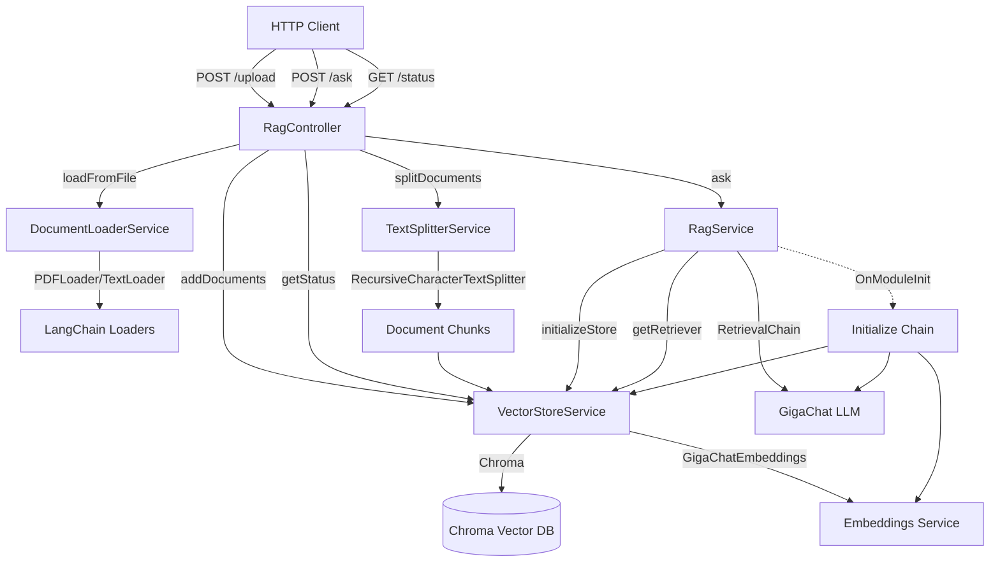

# Архитектура модуля src/agent

Модуль реализует RAG (Retrieval-Augmented Generation) сервис для работы с документами на базе LangChain, GigaChat и Chroma.

## Компоненты системы

### 1. RagController (`rag.controller.ts`)
HTTP контроллер с тремя эндпоинтами:
- `POST /agent/rag/upload` - загрузка документов (PDF/TXT)
- `POST /agent/rag/ask` - задать вопрос по документам
- `GET /agent/rag/status` - статус векторного хранилища

### 2. DocumentLoaderService (`document-loader.service.ts`)
Загружает документы из файлов:
- Поддерживает форматы: PDF и TXT
- Использует LangChain loaders (PDFLoader, TextLoader)
- Временно сохраняет файл на диск, загружает, затем удаляет
- Возвращает массив документов LangChain

### 3. TextSplitterService (`text-splitter.service.ts`)
Разбивает документы на чанки:
- Использует RecursiveCharacterTextSplitter
- Параметры из констант: CHUNK_SIZE=1000, CHUNK_OVERLAP=200
- Подготавливает документы для векторного хранилища

### 4. VectorStoreService (`vector-store.service.ts`)
Управляет векторным хранилищем Chroma:
- Инициализирует Chroma с GigaChatEmbeddings
- Добавляет документы в хранилище (создает эмбеддинги)
- Предоставляет retriever для поиска релевантных документов
- Возвращает статус хранилища (количество документов)

### 5. RagService (`rag.service.ts`)
Основная логика RAG цепочки:
- Инициализируется при старте модуля (OnModuleInit)
- Создает GigaChat LLM и GigaChatEmbeddings
- Настраивает RAG цепочку: RetrievalChain + StuffDocumentsChain
- Обрабатывает вопросы: поиск контекста → генерация ответа

## Потоки данных

### Поток загрузки документа:
```
HTTP POST /upload
  ↓
RagController.upload()
  ↓
DocumentLoaderService.loadFromFile() → Document[]
  ↓
TextSplitterService.splitDocuments() → Document[] (chunks)
  ↓
VectorStoreService.addDocuments() → создает эмбеддинги → сохраняет в Chroma
  ↓
Возврат: { uploaded, chunks, ids }
```

### Поток обработки вопроса:
```
HTTP POST /ask
  ↓
RagController.ask()
  ↓
RagService.ask(question)
  ↓
RetrievalChain.invoke({ input: question })
  ├─→ VectorStore.getRetriever() → поиск k=4 релевантных документов
  └─→ StuffDocumentsChain → объединение контекста + вопрос → LLM
  ↓
GigaChat LLM генерирует ответ на основе контекста
  ↓
Возврат: { answer, context }
```

## Конфигурация

Константы (`constants.ts`):
- DEFAULT_RETRIEVER_K: 4 (количество документов для поиска)
- CHUNK_SIZE: 1000 (размер чанка)
- CHUNK_OVERLAP: 200 (перекрытие между чанками)
- MAX_QUESTION_LENGTH: 2000 (максимальная длина вопроса)

Переменные окружения:
- GIGACHAT_API_KEY - ключ API GigaChat
- GIGACHAT_API_URL - URL API GigaChat
- CHROMA_DB_PATH - путь к Chroma БД
- CHROMA_COLLECTION_NAME - имя коллекции в Chroma

## Инициализация

При старте модуля:
1. RagService.onModuleInit() создает GigaChat LLM и Embeddings
2. VectorStoreService.initializeStore() инициализирует Chroma
3. RagService настраивает RAG цепочку с retriever и combineDocsChain

## Диаграмма архитектуры



## Особенности реализации

1. **Безопасность**: Временные файлы удаляются после загрузки
2. **Обработка ошибок**: Все сервисы логируют ошибки через Logger
3. **Валидация**: DTO валидирует входные данные (AskQuestionDto)
4. **Ленивая инициализация**: VectorStore инициализируется при первом использовании
5. **RAG паттерн**: Использует стандартный RAG с retrieval и generation этапами